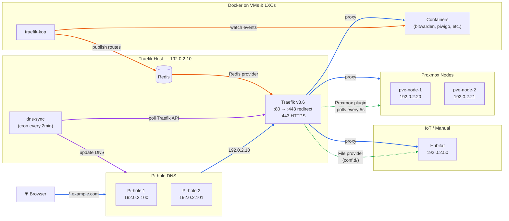

# Traefik Homelab

My home network reverse proxy setup using [Traefik](https://traefik.io/) v3 with automatic service discovery from Proxmox VMs, Docker containers, and manual routes — plus automatic DNS sync to Pi-hole.

## Architecture



**Legend:** 🔵 Request flow &nbsp; 🟢 Provider discovery &nbsp; 🟠 traefik-kop → Redis &nbsp; 🟣 DNS sync

## How It Works

Traefik runs as a bare-metal systemd service (not in Docker) and aggregates routes from **four providers**:

| Provider | Source | How services are registered |
|----------|--------|-----------------------------|
| **File** | YAML files in `conf.d/` | Manual router/service definitions for devices like Hubitat |
| **Redis** | Redis on localhost, fed by [traefik-kop](https://github.com/jittering/traefik-kop) | Docker labels on VMs/LXCs are published to Redis automatically |
| **Proxmox Plugin** | Custom fork of [traefik-proxmox-provider](https://github.com/NX211/traefik-proxmox-provider) | Traefik labels in VM/container **Description** fields in Proxmox |
| **Internal** | Built-in | Traefik dashboard and API |

Every hostname resolves to Traefik because a [dns-sync script](dns-sync/) polls the Traefik API and pushes all `Host()` rules to two Pi-hole instances as local DNS records.

## Components

### [traefik/](traefik/)
Core Traefik configuration:
- `traefik.yaml` — Static configuration (entrypoints, provider settings, logging)
- `conf.d/dynamic.yaml` — TLS certificates, shared middlewares, manual routers
- `conf.d/acng-middleware.yaml` — Path rewrite middleware for apt-cacher-ng
- `conf.d/pihole-middleware.yaml` — Root redirect middleware for Pi-hole web UI
- `traefik.service` — systemd unit file

### [traefik-proxmox-provider/](traefik-proxmox-provider/)
Custom fork of the Proxmox provider plugin that adds **multi-node support** — configure multiple independent Proxmox hosts, each with their own API credentials. Services are discovered by reading traefik labels from VM/container Description fields. See the [traefik-proxmox-provider-multi-node](https://github.com/jonnewman85/traefik-proxmox-provider-multi-node) repo for the full source.

### [traefik-kop/](traefik-kop/)
How [traefik-kop](https://github.com/jittering/traefik-kop) bridges Docker containers on other VMs and LXCs to Traefik via Redis. Containers use standard Traefik Docker labels, and traefik-kop publishes them to Redis where Traefik's Redis provider picks them up.

### [dns-sync/](dns-sync/)
A custom Python script that automatically syncs Traefik router hostnames to Pi-hole v6 local DNS. Runs every 2 minutes via cron, with change detection, backup/rollback, and per-instance Pi-hole authentication. See the [traefik-pihole-sync](https://github.com/jonnewman85/traefik-pihole-sync) repo for the standalone version.

## DNS

Two Pi-hole instances provide redundant DNS for the network. Pi-hole 1 (192.0.2.100) is the **primary** and Pi-hole 2 (192.0.2.101) is the **secondary**. Both IPs are distributed to clients via DHCP (or manually configured on devices that use static DNS). If either Pi-hole goes down, clients automatically fall back to the other.

The [dns-sync script](dns-sync/) keeps both instances in sync by pushing the same set of Traefik-derived local DNS records to each. Gravity (blocklists) and other Pi-hole configuration are replicated separately from primary to secondary.

## TLS

A pre-provisioned wildcard certificate for `*.example.com` is used (not ACME/Let's Encrypt). The cert is configured as the default TLS store in `conf.d/dynamic.yaml`. All HTTPS routers automatically use it.

## Active Services

Examples of services discovered from **Proxmox** (automatic):
`Home Assistant`, `immich`, `kestra`, `openweb`, `paperless`, `pihole1 (dns1)`, `pihole2 (dns2)`, …

Examples of services from **Docker via Redis** (automatic via traefik-kop):
`bitwarden`, `piwigo`, `handbrake`, …

Services from **File provider** (manual):
`hubitat`, `traefik dashboard`

## Adding a New Service

### Proxmox VM or Container
Add traefik labels to the **Description** field in the Proxmox web UI:
```
traefik.enable=true
traefik.http.routers.myapp.rule=Host(`myapp.example.com`)
traefik.http.routers.myapp.entrypoints=websecure
traefik.http.routers.myapp.middlewares=security-headers@file
traefik.http.services.myapp.loadbalancer.server.port=8080
```
The provider polls every 5 seconds and will pick it up automatically.

### Docker Container (VM or LXC)
Add standard Traefik labels to the container. traefik-kop will detect it and publish to Redis:
```yaml
labels:
  - "traefik.enable=true"
  - "traefik.http.routers.myapp.rule=Host(`myapp.example.com`)"
  - "traefik.http.routers.myapp.entrypoints=websecure"
  - "traefik.http.services.myapp.loadbalancer.server.port=8080"
```

### Static Device (e.g. IoT)
Add a router and service to `traefik/conf.d/dynamic.yaml`:
```yaml
http:
  routers:
    mydevice:
      entryPoints: ["websecure"]
      rule: "Host(`mydevice.example.com`)"
      service: mydevice
      middlewares: [security-headers]
  services:
    mydevice:
      loadBalancer:
        servers:
          - url: "http://192.0.2.XX:80"
```

### DNS
No action needed — the dns-sync script will automatically detect the new hostname from the Traefik API and add it to both Pi-hole instances within 2 minutes.

## References

- [Traefik](https://traefik.io/) — The reverse proxy at the core of this setup
- [Traefik Redis Provider](https://doc.traefik.io/traefik/providers/redis/) — Built-in provider for Redis-backed configuration
- [Traefik File Provider](https://doc.traefik.io/traefik/providers/file/) — Built-in provider for YAML/TOML file-based configuration
- [Traefik Local Plugins](https://doc.traefik.io/traefik/plugins/local/) — How the Proxmox provider is loaded
- [traefik-kop](https://github.com/jittering/traefik-kop) — Publishes Docker container labels to Redis for Traefik
- [traefik-proxmox-provider](https://github.com/NX211/traefik-proxmox-provider) — Upstream Proxmox provider plugin
- [traefik-proxmox-provider-multi-node](https://github.com/jonnewman85/traefik-proxmox-provider-multi-node) — My fork with multi-node support
- [traefik-pihole-sync](https://github.com/jonnewman85/traefik-pihole-sync) — My standalone Pi-hole DNS sync script
- [Pi-hole v6 API](https://docs.pi-hole.net/api/) — REST API used by the dns-sync script
- [Pi-hole v6 Authentication](https://docs.pi-hole.net/api/auth/) — Session-based auth used by the dns-sync script
